# ⚡ Awesome Virtual Power Plant (VPP) — SaaS Platforms, DERMS & Open-Source Projects

  

## 🌍 Top Virtual Power Plant (VPP) Platforms Ecosystem
**Curated List of SaaS Products & Open-Source GitHub Projects**
*Focused on DER Aggregation, Flexibility Markets, Demand Response, Battery & EV Orchestration, Grid Services & Real-Time Dispatch*
**Last updated: August 2026**

This repository is a curated list of the best **Virtual Power Plant (VPP)** software, **DERMS platforms** and **open-source energy projects** for aggregating **distributed energy resources (DERs)** — solar PV, battery energy storage, EVs, flexible loads and smart thermostats — into coordinated portfolios that deliver **demand response**, trade in **flexibility markets**, provide **grid services** and optimize behind-the-meter assets in real time. Whether you are a utility, an aggregator, an energy startup or a researcher, you will find production-ready SaaS products plus transparent, standards-based open-source tools for VPP control, DER scheduling, energy management and market optimization.

**Examples** include AutoGrid, Next Kraftwerke, Tesla Autobidder, Sunverge, GridBeyond, Enel X, Piclo, EnergyHub, Limejump, and Flexitricity (the category leaders).

**Open-source emphasis**: This section is heavily expanded with every major active project for VPP simulation, DERMS, flexibility optimization, DER modeling, and open energy management stacks — ideal for utilities, aggregators, researchers, and developers seeking transparent, standards-based control of distributed resources.

**What's inside**:
- ☁️ **10 leading SaaS VPP platforms** — with specific starting-tier pricing, free-tier limits and company size (revenue/valuation), sorted by size.
- 🐙 **24 open-source GitHub projects** — VPP platforms, DERMS, flexibility optimization, DER modeling and open energy management stacks, sorted by GitHub stars.
- 🧩 **Building blocks** — co-simulation frameworks (GridLAB-D, HELICS), protocol stacks (OpenADR, IEEE 2030.5, IEC 61850, OCPP) and optimization libraries (OR-Tools, Pyomo, CVXPY) to assemble your own VPP stack.

🙌 Contributions welcome! Open a PR to add/update entries. Keep descriptions factual and link to official sites.

## 📑 Table of Contents
- ☁️ [SaaS/Hosted Platforms](#saas-products)
- 🐙 [Open-Source GitHub Projects](#open-source-github-projects)
- ❓ [Frequently Asked Questions](#frequently-asked-questions)
- 🤝 [How to Contribute](#how-to-contribute)
- ⚠️ [Disclaimer](#disclaimer)

## ☁️ SaaS/Hosted Platforms

📊 Sorted by **company size (revenue or valuation), descending**. Pricing and free-tier details reflect publicly available information as of **August 2026**; most enterprise DERMS vendors do not publish list prices, so entries show the most specific documented entry points.

| 🏢 Platform | 🎯 Focus | 💰 Pricing (starting tier) | 🆓 Free tier / trial | 📈 Company size (revenue / valuation) |
|---|---|---|---|---|
| [Next Kraftwerke](https://www.next-kraftwerke.com/) | Pan-European VPP trading, balancing & aggregation | No list price — fixed monthly marketing fee scaled by installed capacity for solar < 800 kWp (3 published tariff tiers); profit-share of market revenues for larger assets | No free plan — asset operators join via a direct-marketing contract and are *paid* for dispatched flexibility (free online tariff calculator) | **Shell** (100% owner since 2021) — FY2024 revenue ~$284B |
| [Limejump](https://www.limejump.com/) | UK VPP & flexibility trading (Shell) | Historical contracts passed through energy at **110–120% of System Buy Price (SBP)**; no new contracts offered since 2024 | No free tier — customer book sold to F&S Energy (May 2024); closed to new signups | **Shell** (owner since 2019) — FY2024 revenue ~$284B |
| [Tesla Autobidder](https://www.tesla.com/) | Real-time trading & dispatch of Tesla energy assets | No public price — bundled with Tesla Energy (Powerwall/Megapack) and utility contracts; related Tesla Fleet API from **$0.002/vehicle-data request, $0.001/command** | No public free tier for Autobidder; Tesla Fleet API includes a **$10/month developer discount** | **Tesla** — FY2024 revenue **$97.7B** |
| [Enel X](https://www.enelx.com/) | Global demand response & VPP | No software fee for participants — paid for curtailed flexibility by utilities/TSOs; compensation varies by market (e.g., PJM capacity & energy payments) | No free plan — enrollment-based DR participation with payments for dispatched flexibility (free demand-response earnings calculator) | **Enel Group** — FY2024 revenue **€78.9B (~$85B)** |
| [AutoGrid](https://www.autogrid.com/) | Enterprise DERMS & flexibility platform (Schneider Electric) | Not publicly listed — multi-year enterprise SaaS contracts; now also "megawatts-as-a-service" (software + MW, e.g., Puget Sound Energy) | No free tier or trial — sales-led onboarding for utilities & aggregators | **Schneider Electric** (owner since 2022) — FY2024 revenue **€38.2B (~$41B)** |
| [Flexitricity](https://www.flexitricity.com/) | UK demand-side response & balancing | Revenue-share model — TSO/market payments passed through minus Flexitricity's share (e.g., a media site earned up to **£250k over 5 years**, 2016 case) | No free tier — contracted participation for asset owners with flexible capacity (typically > 1 MW) | **Drax Group** (acquired 2026 for **£36M**) — FY2024 revenue **£6.1B (~$7.7B)** |
| [Sunverge](https://www.sunverge.com/) | Residential DERMS & VPP software | Not publicly listed — per-device/per-home SaaS licensed to utilities & OEM partners | No free tier — platform sold to utilities/OEMs; consumers join programs free via partner utilities | Private — **~$81M raised** (CB Insights); DERMS sold to Budderfly (2024) |
| [GridBeyond](https://www.gridbeyond.com/) | AI-driven flexibility platform (commercial & industrial) | Not publicly listed — recurring platform subscription + performance-based share of flexibility revenues | No free tier — free site assessment & pilot via sales team | Private — **€52M Series C** (Apr 2024); revenue growing ~70%/yr |
| [Piclo](https://www.piclo.energy/) | Flexibility marketplace (buyers & sellers) | **Free** for DER sellers (register assets, market evaluation, dispatch, settlement); paid Basic/Full seller plans and buyer tiers (Starter/Standard/Enhanced) **by quote** | **Free-forever seller plan**: unlimited asset registration, market opportunity evaluation, dispatch notifications & settlement; advanced tools (adaptive bidding, APIs, SSO) on paid tiers | Private — **~£23M raised** (Series B £8.3M, 2023) |
| [EnergyHub](https://www.energyhub.com/) | Utility DERMS & residential VPP platform | Not publicly listed — per-program/per-device SaaS contracts with utilities | No public free tier — consumers participate **free** through utility-sponsored programs (incentives/rebates); platform itself sold to utilities | Private — **~$21M raised**; 120+ utility customers; ~2,900 MW managed; acquired Resideo Grid Services (2025) |

## 🐙 Open-Source GitHub Projects

⭐ Sorted by **GitHub stars, descending**. Star badges (style=social, color=white) link to each repo's stargazers page and update automatically.

- **[Home Assistant](https://github.com/home-assistant/core) **
  Open-source home automation platform with the most widely deployed open energy-management dashboard; integrates solar, batteries, EV chargers and heat pumps from hundreds of vendors and is frequently used as the EMS front-end for residential VPP programs.

- **[Google OR-Tools](https://github.com/google/or-tools) **
  Google's open-source optimization suite (CP-SAT, MIP, LP, routing, scheduling) widely used to build multi-period dispatch, unit-commitment and market-bidding engines for DER portfolios.

- **[EVCC](https://github.com/evcc-io/evcc) **
  Open-source EV charging controller that manages solar-aware charging, load balancing and dynamic tariffs across 100+ chargers and inverters; enables home/EV flexibility for VPP and grid-service use cases.

- **[CVXPY](https://github.com/cvxpy/cvxpy) **
  Python-embedded convex optimization modeling library used for battery dispatch, portfolio optimization and grid-constraint-aware scheduling in DERMS research and production systems.

- **[Pyomo](https://github.com/Pyomo/pyomo) **
  Python optimization modeling language supporting LP/MIP/NLP solvers; a common choice for multi-period DER dispatch, flexibility market bidding and VPP scheduling research.

- **[OpenEMS](https://github.com/OpenEMS/openems) **
  The leading open-source Energy Management System for residential and commercial DER; provides modular control of solar, storage and EV chargers plus VPP interfaces and market-optimized operation.

- **[emonCMS](https://github.com/emoncms/emoncms) **
  Open-source web application for energy monitoring and analysis (solar, import/export, temperature, power quality); a common open data layer for DER dashboards and VPP monitoring.

- **[EMHASS](https://github.com/davidusb-geek/emhass) **
  Open-source Home Assistant add-on that performs day-ahead and real-time optimization of home energy assets (PV, batteries, EV, heat pumps) using linear programming.

- **[VOLTTRON](https://github.com/VOLTTRON/volttron) **
  DOE's open-source distributed sensing and control platform for DER coordination, transactive energy and building-to-grid integration; supports protocols like Modbus, BACnet and OpenADR.

- **[Grid2Op](https://github.com/Grid2op/grid2op) **
  Open-source environment for training and benchmarking reinforcement-learning agents on power-grid operations, including topology control, redispatching and curtailment scenarios.

- **[oemof-solph](https://github.com/oemof/oemof-solph) **
  Open-source energy system modeling framework (part of the oemof project) for optimizing multi-energy systems, storage and flexibility over time.

- **[power-grid-model](https://github.com/PowerGridModel/power-grid-model) **
  Alliander's high-performance C++/Python power-flow and state-estimation engine with a Python API; used for fast grid-impact analysis in DER connection and flexibility studies.

- **[GridLAB-D](https://github.com/gridlab-d/gridlab-d) **
  Open-source distribution system simulation platform (DOE/PNNL) for modeling DER, demand response and distribution operations at scale.

- **[FlexMeasures (LF Energy)](https://flexmeasures.io/) **
  Open-source energy management and flexibility toolkit for optimizing schedules of batteries, EVs, processes, and other flexible assets; designed for EMS and VPP use cases.

- **[HELICS](https://github.com/GMLC-TDC/HELICS) **
  High-performance co-simulation framework (GMLC) for coupling power system, communication and market simulators — used to study VPP impacts across transmission–distribution boundaries.

- **[OpenLEADR](https://github.com/OpenLEADR/openleadr-python) **
  Python implementation of the OpenADR 2.0b/VEN standard for automated demand response; a key building block for connecting DER fleets to utility DR programs.

- **[Virtual Power Plant Platform (vinerya)](https://github.com/vinerya/virtual-power-plant) **
  Comprehensive open-source VPP platform with production-ready optimization, multi-protocol DER control, V2G support, and benchmarking tools.

- **[OpenDER (EPRI)](https://github.com/epri-dev/OpenDER) **
  Open-source DER model implementing IEEE 1547-2018 behaviors for steady-state and dynamic studies of inverter-based resources.

- **[NREL Virtual Battery Aggregator](https://github.com/NatLabRockies/virtual-battery-aggregator) **
  Open-source algorithms that aggregate DERs into a virtual battery model and dispatch setpoints for DERMS platforms.

- **[vpp-sim](https://github.com/jdhoffa/vpp-sim) **
  Lightweight open-source simulator for small commercial & industrial VPPs, modeling solar, batteries, flexible loads, and demand-response events.

- **[Alliander DER Scheduling](https://github.com/alliander-opensource/der-scheduling) **
  Open-source scheduling stack for DER control according to IEC 61850 standards.

- **[DER-VET (EPRI)](https://github.com/epri-dev/DER-VET) **
  EPRI's Distributed Energy Resource Value Estimation Tool — open-source techno-economic modeling of DER (storage, PV, EV) value streams for VPP and grid-service analyses.

- **[GridAPPS-D](https://github.com/GRIDAPPSD/GridAPPS-D) **
  Open-source DOE platform and modeling environments for developing and testing DERMS applications on distribution systems.

- **[EnergyLink Open-Source DERMS](https://github.com/vpdeva/Energylink-Open-Source-DERMS) **
  Open-source energy data exchange and Distributed Energy Resource Management System with connectors, analytics, and dashboards.

### 🔧 Additional Strong Open-Source Options
- IEC 61850, IEEE 2030.5, OpenADR, and SunSpec protocol stacks and clients.
- Time-series databases (InfluxDB, Timescale) + Grafana for DER monitoring and VPP dashboards.
- Optimization libraries (OR-Tools, Pyomo, CVXPY) applied to multi-period dispatch and market bidding — see starred entries above.
- Co-simulation frameworks (GridLAB-D, OpenDSS, HELICS) for studying VPP impacts on the grid — see starred entries above.

🧩 **Frameworks for building custom systems**: Use **FlexMeasures** or the **vinerya VPP platform** as the core optimization and scheduling layer, model individual DERs with **OpenDER** or battery abstractions, aggregate them via the **NREL Virtual Battery Aggregator** or custom ADMM/coordination logic, and connect to devices through open protocols (IEEE 2030.5, Modbus, OCPP, OpenADR). Simulate portfolios with **vpp-sim** or GridAPPS-D before live deployment. Store telemetry in open time-series stores and expose market/grid-service interfaces via APIs.

## ❓ Frequently Asked Questions

**What is a Virtual Power Plant (VPP)?**
A VPP is a network of distributed energy resources (DERs) — solar, battery storage, EVs and flexible loads — coordinated by software to act like a single power plant. It provides demand response, grid balancing and ancillary services while trading in wholesale electricity and flexibility markets.

**What is a DERMS?**
A Distributed Energy Resource Management System (DERMS) is the software layer utilities and aggregators use to monitor, control and optimize fleets of DERs — thermostats, batteries, EV chargers, solar inverters — for grid reliability, congestion relief and market participation.

**How much do VPP platforms cost?**
Pricing varies widely. Some offer free-forever plans (e.g., Piclo's free seller plan), while most enterprise DERMS vendors (AutoGrid, EnergyHub, GridBeyond) sell under custom utility contracts. The SaaS table above lists the most specific publicly documented starting-tier pricing and free-tier limits.

**Can I build my own VPP with open-source tools?**
Yes. Combine **FlexMeasures** or the **vinerya VPP platform** for optimization and scheduling, **OpenDER** for DER modeling, the **NREL Virtual Battery Aggregator** for aggregation, and open protocols (OpenADR, IEEE 2030.5, Modbus, OCPP) for device connectivity — see the open-source section for the full stack.

## 🤝 How to Contribute
1. Fork the repo.
2. Add/edit entries in `README.md` (follow existing format).
3. Include: name, link, 1–2 sentence description, and whether it's SaaS or open-source.
4. Submit PR with a short explanation.

⭐ Star the repo if you find it useful!

## ⚠️ Disclaimer
- This is a **community-curated** list — not exhaustive and not an endorsement.
- Pricing and free-tier details are based on publicly available information as of **August 2026** and change frequently; verify directly with vendors before making decisions.
- VPPs interact with critical energy infrastructure and regulated markets. Open-source components are powerful for research, simulation, and non-critical control layers but must be thoroughly validated, cybersecurity-hardened, and approved by relevant grid operators or regulators before operational use.
- Always ensure compliance with local interconnection standards, market rules, data privacy, and grid codes.

---
🔌 **Made for utilities, aggregators, energy startups, and researchers building the flexible grid of the future.**
Let's make virtual power plants more open, interoperable, and democratically controllable. ⚡
